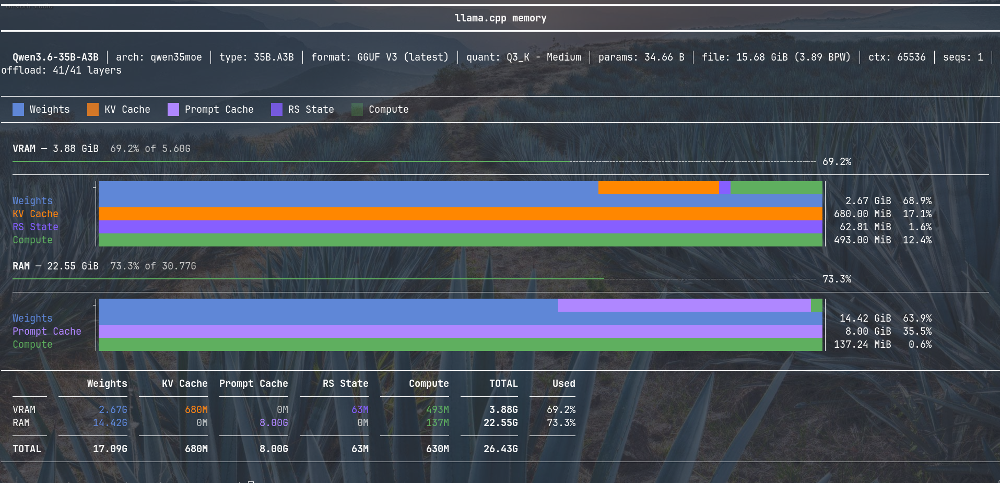
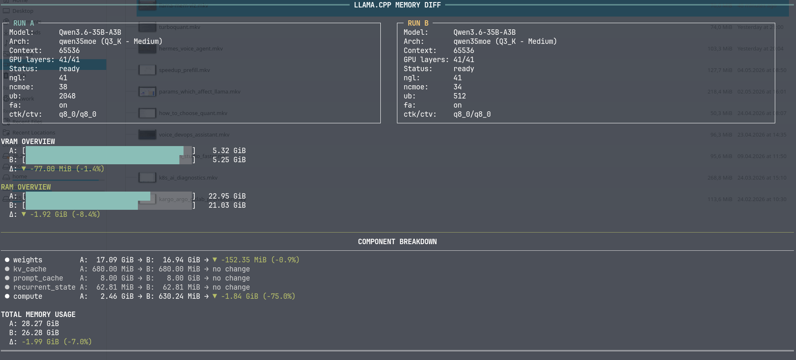

# llama-mem-viz

`llama-mem-viz` is a lightweight, **stdlib-only** Python tool that visualizes **RAM/VRAM** memory usage of **llama.cpp** (`llama-server` or `llama-cli`).

It parses the llama.cpp startup log output in real time and helps you understand memory allocation by component, GPU offloading behavior, and **Out-Of-Memory (OOM)** / allocation failures.




## Features

- RAM / VRAM memory visualization
- Per-component breakdown:
  - Weights
  - KV Cache
  - Prompt Cache
  - Recurrent State
  - Compute buffers (incl. Compute PP)
- OOM / allocation failure detection
- JSON output mode (`--json`)
- No external dependencies (no `pip install` required)

## Requirements

- Python 3.10+ recommended (should work on most Python 3 versions)
- `llama-server` or `llama-cli` available on `PATH` (or use `--binary`)
- Linux recommended (tested on Linux)

Optional:
- `nvidia-smi` for VRAM total/free detection

## Installation

```bash
git clone https://github.com/digitalstudium/llama-mem-viz.git
cd llama-mem-viz
chmod +x llama-mem-viz.py
chmod +x llama-mem-diff.py
```

## Usage

### Visualize a single run

Pass regular `llama-server` / `llama-cli` arguments directly to the script:

```bash
./llama-mem-viz.py -m model.gguf -c 65536 -ngl 40
```

If you want machine-readable output:

```bash
./llama-mem-viz.py --json -m model.gguf -c 65536 -ngl 40 > run.json
```

### Example scripts

#### `visualize.sh`

Run your predefined single visualization scenario:

```bash
./visualize.sh
```

#### `compare.sh` (two runs + visual diff)

This repo includes a simple hardcoded comparison workflow:

1. Run configuration A → `a.json`
2. Run configuration B → `b.json`
3. Visualize the diff between them

Run it:

```bash
./compare.sh
```

The current `compare.sh` looks like this (example):

```bash
./llama-mem-viz.py --json -m /path/to/model.gguf ... -ub 2048 > a.json
./llama-mem-viz.py --json -m /path/to/model.gguf ... -ub 512  > b.json
./llama-mem-diff.py a.json b.json
```

### Notes

- Memory numbers can vary slightly between runs due to allocator state / fragmentation.
- On non-Linux platforms (Windows/macOS) behavior is currently untested and may be partially broken.

